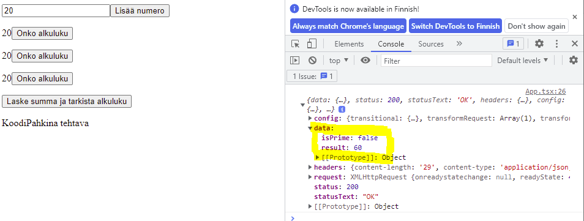

# Code challenge, prime number task

# Task Eng 

- todo

# Task Fin

Toteuta backend rajapinta joka osaa:

a) laskea yhteen lukuja sekä kertoa onko summattu luku alkuluku
b) kertoa onko jokin luku alkuluku

Toteuta lisäksi haluamallasi tavalla HTML + JS / Typescript (ES6) sivu, jolla rajapintaa voi testata (sivun ei tarvitse olla ulkoasullisesti tyylikäs, kunhan koodi on selkeää). Sivussa tulisi pystyä syöttämään 1-n numeroa jotka lähetetään rajapintaan kahdelle eri kutsulle (toiselle kutsulle vain yksi).

Rajapinnassa tulisi olla kaksi eri kutsua: yhteenlasku, joka tarkistaa myös onko yhteenlaskettu luku alkuluku sekä alkuluvun tarkistus kutsu, joka ottaa vastaan yhden luvun ja kertoo onko se alkuluku

Rajapinta voisi *esimerkiksi* toimia seuraavanlaisella kutsulla `http://localhost/myapi/sum?numbers=1,2,3`
joka palauttaisi esimerkiksi `{"result":6, "isPrime": false}`

Rajapinta voisi *esimerkiksi* toimia seuraavanlaisella kutsulla `http://localhost/myapi/checkprime?number=12345`
joka palauttaisi esimerkiksi `{"isPrime": false}`

Yritä panostaa selkeään ja kompaktiin koodiin, ja pyri hyödyntämään valmiita metodeita niin backend kuin frontend puolellakin. Käytämme yleensä front endissä Reactia.

Sovelluksen suorittamisessa olisi hyvä käyttää Docker-konttia tai hyvä ohjeistus sen käynnistämiseksi.

Tehtävän voi palauttaa minulle esim. github repositorion tai vaikka zip filen kautta. Tyyli vapaa, mutta pakollinen. Minä laitan koodinäytteen meidän kehittäjille katselmoitavaksi ja sen mukaan päätämme jatkammeko tekniseen haastatteluun.

Back-end and front-end app

a) laskea yhteen lukuja sekä kertoa onko summattu luku alkuluku
b) kertoa onko jokin luku alkuluku

This project was bootstrapped with [Create React App](https://github.com/facebook/create-react-app).

First install

### `npm install`

Then start frontend

### `npm start`

Open (http://localhost:3000) to view it in the browser.
Open developers tools and console to see returning result
Open another cmd and go to `\backEndKoodipahkina` folder
and `npm start` to start backend

